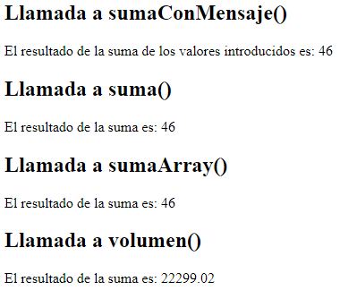

---
# Arrays
---

[Arrays](https://github.com/ComandPromt/Ejemplos-PHP/tree/master/Arrays)

---
# Sesiones
---
[Sesion](https://github.com/ComandPromt/Ejemplos-PHP/tree/master/Sesiones)

---
# Ejemplos de autenticación
---

[Autenticación](https://github.com/ComandPromt/Ejemplos-PHP)

---
# Formulario
---

[Formulario](https://github.com/ComandPromt/Ejemplos-PHP/tree/master/Formulario)

---
# Operaciones BD Mysqli - PDO
---

[BD](https://github.com/ComandPromt/Ejemplos-PHP/tree/master/BD)

---
# Funciones
---

[Funciones](https://github.com/ComandPromt/Ejemplos-PHP/tree/master/Bibliotecas)

---
# Clase Rectángulo
---
[Clase](https://github.com/ComandPromt/Ejemplos-PHP/tree/master/Bibliotecas)

---
# Foreach
---
[Foreach](https://github.com/ComandPromt/Ejemplos-PHP/tree/master/foreach)

---
# Tabla Precios
---

[Tabla de precios](https://github.com/ComandPromt/Ejemplos-PHP/blob/master/tabla_precios.php)

---
# Tabla Precios Referencia
---

[Ejemplo1](https://github.com/ComandPromt/Ejemplos-PHP/blob/master/tabla_precios_referencia.php)

[Ejemplo2](https://github.com/ComandPromt/Ejemplos-PHP/tree/master/Ramon_Ejercicio_3)

[Ejemplo3 _BD](https://github.com/ComandPromt/Ejemplos-PHP/tree/master/lista%20de%20usuarios)

---
# Temperaturas
---

[Temperaturas](https://github.com/ComandPromt/Ejemplos-PHP/blob/master/temp_media_estaciones.php)

[Temperaturas](https://github.com/ComandPromt/Ejemplos-PHP/blob/master/temperaturas_localidades.php)

---
# Nota media
---

[Notas](http://localhost/Ejemplos-PHP-master%20(1)/Ejemplos-PHP-master/vectores_hallar_nota_maxima.php)

---
# Tabla con variables
---

[Variables](https://github.com/ComandPromt/Ejemplos-PHP/tree/master/tabla_con_variables)

---
# Lista de nombres
---

[Hidden](https://github.com/ComandPromt/Ejemplos-PHP/blob/master/hidden.php)

---
# Fecha actual
---

[Fecha](https://github.com/ComandPromt/Ejemplos-PHP/blob/master/fecha.php)

---
# Exportar base de datos
---

[Exportar](https://github.com/ComandPromt/Ejemplos-PHP/blob/master/BD/exportar%20tabla%20mysql.php)

[Importar](https://github.com/ComandPromt/Ejemplos-PHP/blob/master/BD/importar_BD.php)

---
# Condicional
---

[Condicional](https://github.com/ComandPromt/Ejemplos-PHP/tree/master/condicional)

